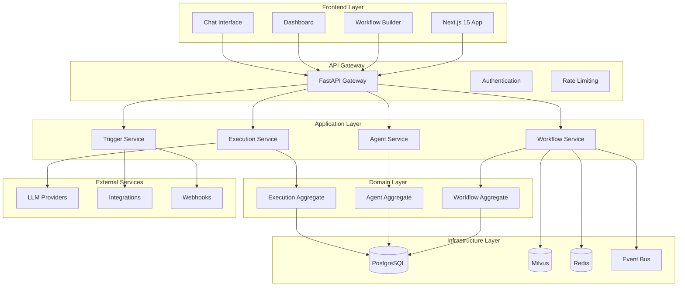
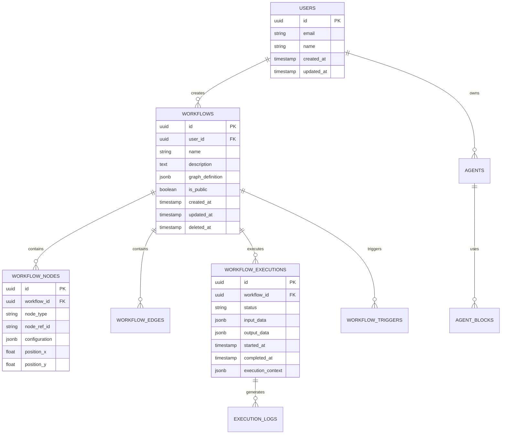
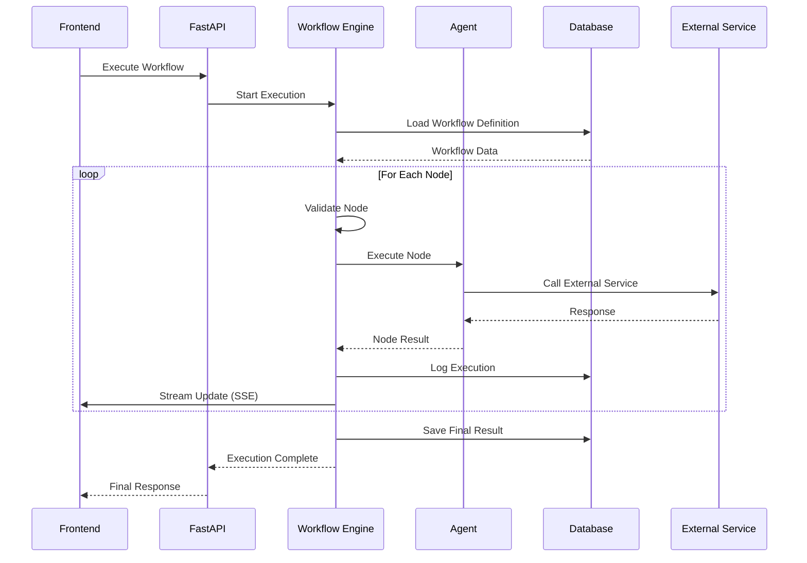
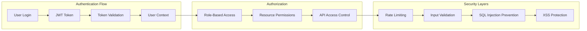
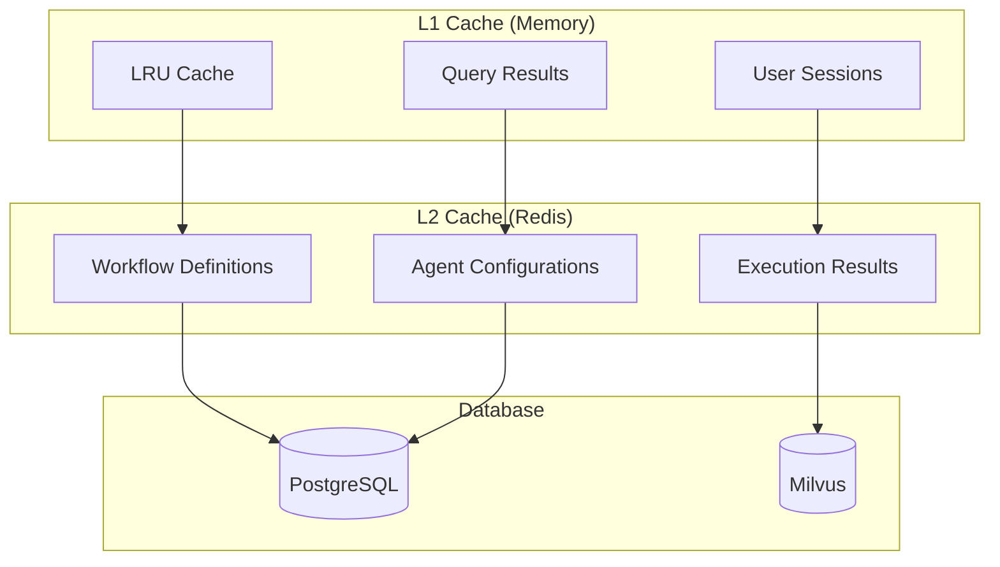
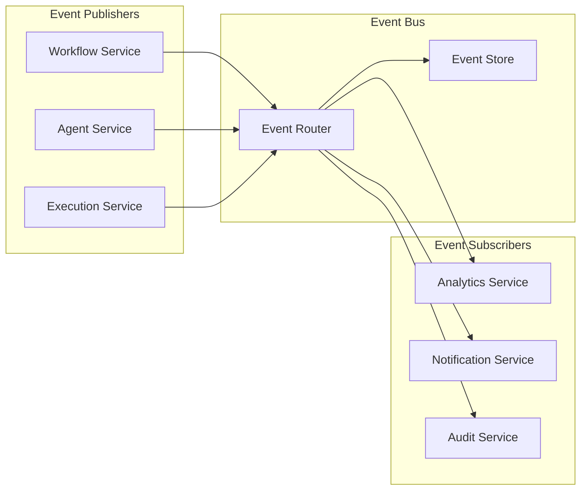
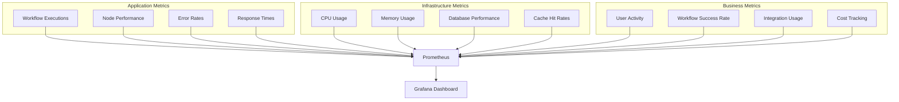

# 🏗️ System Architecture

## Overview

The Workflow Platform is built using a modern, scalable architecture that combines Domain-Driven Design (DDD) principles with microservices patterns. The system is designed to handle enterprise-scale AI workflow automation with high performance and reliability.

## 🎯 Architecture Principles

- **Domain-Driven Design (DDD)**: Clear domain boundaries and aggregates
- **Event-Driven Architecture**: Decoupled components with event bus
- **CQRS Pattern**: Separate read and write operations
- **Multi-Level Caching**: L1 (memory) + L2 (Redis) for optimal performance
- **Circuit Breaker Pattern**: Resilience and fault tolerance
- **Saga Pattern**: Distributed transaction management

## 🏛️ High-Level Architecture



## 🔧 Component Architecture

### Frontend Architecture (Next.js 15)

```
frontend/
├── app/                     # Next.js App Router
│   ├── agent-builder/      # Main workflow builder
│   ├── dashboard/          # Analytics dashboard
│   └── api/               # API routes
├── components/             # React components
│   ├── ui/                # Shadcn/ui components
│   ├── workflow/          # Workflow editor components
│   ├── agent-builder/     # Agent builder components
│   └── chat/              # Chat interface
├── lib/                   # Utilities and configs
│   ├── stores/            # Zustand stores
│   ├── hooks/             # Custom hooks
│   └── api/               # API client
└── styles/                # Global styles
```

**Key Technologies:**
- **Framework**: Next.js 15 with App Router
- **UI Library**: React 19 + Tailwind CSS 4
- **Component Library**: Shadcn/ui
- **State Management**: Zustand + TanStack Query
- **Workflow Editor**: ReactFlow
- **Real-time**: Server-Sent Events (SSE)

### Backend Architecture (FastAPI)

```
backend/
├── api/                    # API endpoints
│   ├── agent_builder/     # Agent builder APIs
│   ├── auth/              # Authentication
│   └── v1/                # API versioning
├── services/              # Business logic
│   ├── agent_builder/     # DDD services
│   │   ├── domain/        # Domain entities
│   │   ├── application/   # Application services
│   │   └── infrastructure/# Infrastructure layer
│   ├── rag/               # RAG services
│   └── integrations/      # External integrations
├── core/                  # Core infrastructure
│   ├── dependencies.py    # Dependency injection
│   ├── cache_manager.py   # Multi-level caching
│   ├── event_bus.py       # Event-driven architecture
│   └── security/          # Security utilities
├── db/                    # Database layer
│   ├── models/            # SQLAlchemy models
│   └── repositories/      # Data access layer
└── utils/                 # Utility functions
```

**Key Technologies:**
- **Framework**: FastAPI (Python 3.10+)
- **AI/ML**: LangChain, LangGraph, LiteLLM
- **Database**: SQLAlchemy + Alembic
- **Caching**: Redis with connection pooling
- **Vector DB**: Milvus for embeddings
- **OCR**: PaddleOCR Advanced

## 🗄️ Data Architecture

### Database Design



### Storage Strategy

**PostgreSQL** (Primary Database):
- User data and authentication
- Workflow definitions and metadata
- Execution history and logs
- System configuration

**Milvus** (Vector Database):
- Document embeddings for RAG
- Semantic search capabilities
- Workflow template similarity

**Redis** (Cache & Session Store):
- L2 caching layer
- Session management
- Rate limiting counters
- Real-time execution state

## 🔄 Workflow Execution Engine

### Execution Flow



### Node Types & Execution

**Control Nodes**:
- **Start/End**: Entry and exit points
- **Condition**: Branching logic with JavaScript expressions
- **Loop**: Iterate over arrays or objects
- **Parallel**: Concurrent execution of multiple branches
- **Delay**: Wait for specified duration

**Agent Nodes**:
- **AI Agent**: Custom AI agents with specific roles
- **LLM**: Direct language model interaction
- **Multi-Agent**: Coordinate multiple agents

**Integration Nodes**:
- **HTTP Request**: REST API calls
- **Database**: SQL query execution
- **Email**: Send emails via SMTP
- **Slack**: Slack API integration
- **Webhook**: Receive HTTP webhooks

## 🔐 Security Architecture

### Authentication & Authorization



**Security Features**:
- JWT-based authentication
- Role-based access control (RBAC)
- API key management with scoped permissions
- Rate limiting per user/IP
- Input validation and sanitization
- SQL injection prevention
- XSS protection
- CORS configuration
- Secure headers (HSTS, CSP, etc.)

## 🚀 Performance Optimization

### Caching Strategy



**Performance Targets**:
- **Workflow Execution**: <5s for typical workflows
- **Simple Automations**: <1s response time
- **Complex Multi-Agent Flows**: <10s execution time
- **Cache Hit Rate**: 60%+ for repeated operations
- **API Response Time**: <2s average
- **Real-time Updates**: <100ms latency

### Database Optimization

**Connection Pooling**:
- PostgreSQL: 20 base + 30 overflow connections
- Redis: 50 max connections
- Milvus: 5 connection pool

**Query Optimization**:
- Composite indexes for common queries
- Eager loading for related entities
- Query result caching
- Pagination for large datasets

## 🔄 Event-Driven Architecture

### Event Bus Implementation



**Event Types**:
- `WorkflowCreated`, `WorkflowUpdated`, `WorkflowDeleted`
- `ExecutionStarted`, `ExecutionCompleted`, `ExecutionFailed`
- `NodeExecuted`, `NodeFailed`
- `AgentCreated`, `AgentUpdated`

## 🐳 Deployment Architecture

### Docker Compose Setup

```yaml
version: '3.8'
services:
  frontend:
    build: ./frontend
    ports: ["3000:3000"]
    
  backend:
    build: ./backend
    ports: ["8000:8000"]
    depends_on: [postgres, milvus, redis]
    
  postgres:
    image: postgres:15
    ports: ["5433:5432"]
    
  milvus:
    image: milvusdb/milvus:latest
    ports: ["19530:19530"]
    
  redis:
    image: redis:7-alpine
    ports: ["6380:6379"]
```

### Production Deployment

**Kubernetes Deployment** (Planned v2.0):
```yaml
apiVersion: apps/v1
kind: Deployment
metadata:
  name: workflow-platform
spec:
  replicas: 3
  selector:
    matchLabels:
      app: workflow-platform
  template:
    spec:
      containers:
      - name: backend
        image: workflow-platform/backend:latest
        resources:
          requests:
            memory: "512Mi"
            cpu: "500m"
          limits:
            memory: "1Gi"
            cpu: "1000m"
```

## 📊 Monitoring & Observability

### Metrics Collection



**Monitoring Stack** (Planned):
- **Metrics**: Prometheus + Grafana
- **Logging**: ELK Stack (Elasticsearch, Logstash, Kibana)
- **Tracing**: Jaeger for distributed tracing
- **Alerting**: AlertManager for critical issues

## 🔮 Future Architecture Enhancements

### v2.0 Roadmap

**Microservices Architecture**:
- Split monolithic backend into microservices
- Service mesh with Istio
- API Gateway with Kong

**Advanced AI Features**:
- GraphRAG integration
- Multi-modal AI processing
- Real-time model fine-tuning

**Scalability Improvements**:
- Horizontal auto-scaling
- Database sharding
- CDN integration
- Edge computing support

**Enterprise Features**:
- Multi-tenant architecture
- Advanced RBAC
- Audit logging
- Compliance tools (SOC2, GDPR)

---

This architecture is designed to be:
- **Scalable**: Handle thousands of concurrent workflows
- **Reliable**: 99.9% uptime with fault tolerance
- **Maintainable**: Clean code with clear separation of concerns
- **Extensible**: Easy to add new integrations and features
- **Secure**: Enterprise-grade security throughout