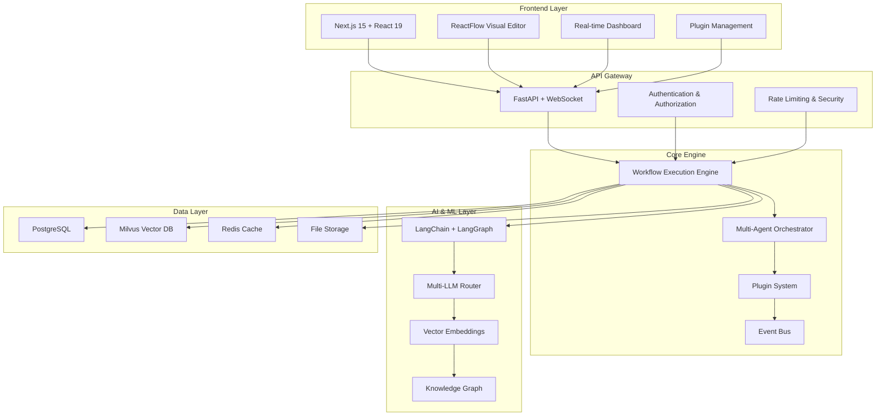

<div align="center">

# 🚀 AgenticBuilder - Visual AI Workflow Builder

### Build, Deploy, and Scale AI Agent Workflows Visually

**The most advanced open-source platform for creating multi-agent AI workflows with drag-and-drop simplicity.**

[](https://opensource.org/licenses/MIT)
[](https://www.python.org/)
[](https://nextjs.org/)
[](https://fastapi.tiangolo.com/)
[](https://docker.com/)

[🎯 Features](#-features) • [🏗 Architecture](#-architecture) • [🚀 Quick Start](#-quick-start) • [📖 Documentation](#-documentation) • [🤝 Contributing](#-contributing)


*🎨 **Visual Agent Builder Interface** - Create sophisticated AI workflows with drag-and-drop simplicity. The screenshot shows the intuitive Block Palette with 50+ pre-built components, real-time workflow canvas, and seamless agent orchestration capabilities.*

</div>

---

## 🎯 What is Agent Builder?

Agent Builder is a **revolutionary visual AI workflow builder** that empowers developers and businesses to create sophisticated multi-agent AI systems without writing complex code. Think of it as the **"Zapier for AI Agents"** - but with enterprise-grade capabilities, advanced orchestration patterns, and unlimited customization.

### 📸 **What You See in the Screenshot**

The interface above demonstrates Agent Builder's powerful visual workflow builder in action:

- **🎛 Left Panel**: Comprehensive Block Palette with categorized components
  - **Agents**: General Agent, Control Agent, AI Agent blocks
  - **Popular Blocks**: Most-used components with popularity indicators
  - **Categories**: Organized seor Plugins, Workflows, Triggers, Data & Knowledge
- **🎨 Center Canvas**: Visual workflow designer showing a sample automation
  - **Connected Blocks**: Email → Database → End workflow with visual connections
  - **Real-time Status**: Live execution indicators and data flow visualization
- **🔧 Right Panel**: Properties and configuration for selected blocks
- **🌐 Multi-language**: Korean interface demonstrating global accessibility

### 🌟 Why Choose Agent Builder?

- **🎨 Visual First**: Drag-and-drop interface powered by ReactFlow
- **🤖 Multi-Agent Orchestration**: 17 advanced orchestration patterns including 2025 trends
- **⚡ Real-time Execution**: Live monitoring with Server-Sent Events
- **🔗 50+ Integrations**: Connect to any API, database, or service
- **🧠 Multi-LLM Support**: OpenAI, Claude, Gemini, Grok, Ollama, and more
- **📊 Enterprise RAG**: Vector search, hybrid search, knowledge graphs
- **🔒 Production Ready**: Security, monitoring, scaling, and deployment

---

## ✨ Features

### 🎨 **Visual Workflow Builder**
| Feature | Description |
|---------|-------------|
| **Drag & Drop Editor** | Intuitive ReactFlow-based visual editor with 50+ pre-built blocks |
| **Real-time Preview** | See your workflow execute in real-time with live data flow |
| **Smart Validation** | Intelligent validation with helpful error messages and suggestions |
| **Version Control** | Built-in versioning with diff visualization and rollback capabilities |

### 🏗 **Agent Builder Interface**
The screenshot above showcases our powerful Agent Builder interface with:

| Component | Description |
|-----------|-------------|
| **🎛 Block Palette** | Comprehensive library of 50+ pre-built blocks organized by category |
| **📋 Block Categories** | Agents, Plugins, Workflows, Triggers, Data & Knowledge, Orchestration, and Developers sections |
| **🔧 Popular Blocks** | Quick access to frequently used components like General Agent, Control Agent, and specialized agents |
| **🎨 Visual Canvas** | Drag-and-drop workflow designer with real-time connection visualization |
| **⚡ Live Execution** | Real-time workflow execution with visual feedback and status indicators |
| **🔗 Smart Connections** | Intelligent block linking with automatic data flow validation |

**Key Interface Features:**
- **Korean/English Support**: Fully localized interface for global accessibility
- **Dark/Light Theme**: Professional UI that adapts to your preference
- **Responsive Design**: Works seamlessly across desktop, tablet, and mobile devices
- **Contextual Help**: Built-in tooltips and guidance for every component
- **Keyboard Shortcuts**: Power-user shortcuts for rapid workflow development

### 🤖 **Advanced Agent Orchestration**
| Pattern Category | Patterns | Use Cases |
|------------------|----------|-----------|
| **Core Patterns** | Sequential, Parallel, Hierarchical, Adaptive | Basic workflow automation |
| **2025 Trends** | Consensus Building, Dynamic Routing, Swarm Intelligence, Event-Driven, Reflection | Advanced AI coordination |
| **2026 Next-Gen** | Neuromorphic, Quantum Enhanced, Bio-Inspired, Self-Evolving, Federated, Emotional AI | Cutting-edge AI research |

### 🔗 **Extensive Integrations**
- **Communication**: Slack, Discord, Email, SMS, Teams
- **Databases**: PostgreSQL, MySQL, MongoDB, Redis, Milvus
- **APIs**: REST, GraphQL, WebSocket, gRPC
- **Cloud Services**: AWS, GCP, Azure, Cloudflare
- **AI Services**: OpenAI, Anthropic, Google AI, Cohere, Hugging Face
- **Document Processing**: PDF, DOCX, PPTX, Excel, OCR
- **Web**: Web scraping, search engines, social media APIs

### 🧠 **Enterprise RAG & Knowledge Management**
- **Vector Search**: Milvus-powered semantic search with 1000+ embedding models
- **Hybrid Search**: Combine semantic and keyword search with BM25
- **Knowledge Graphs**: NetworkX-powered entity relationship mapping
- **Document Processing**: Advanced PDF, Office, and image processing with OCR
- **Multi-modal AI**: Support for text, images, audio, and video processing

### ⚡ **Performance & Scalability**
- **Real-time Streaming**: Server-Sent Events for live execution monitoring
- **Auto-scaling**: Dynamic resource allocation based on workload
- **Caching**: Redis-powered intelligent caching for optimal performance
- **Load Balancing**: Built-in load balancing for high-availability deployments
- **Monitoring**: Comprehensive metrics, logging, and error tracking

---

## 🏗 Architecture



### 🛠 **Technology Stack**

#### **Frontend**
- **Framework**: Next.js 15 with React 19 and TypeScript
- **UI Components**: Radix UI + Tailwind CSS + Framer Motion
- **Visualization**: ReactFlow for workflow diagrams, D3.js for analytics
- **State Management**: Zustand + TanStack Query for server state
- **Real-time**: Server-Sent Events + WebSocket connections

#### **Backend**
- **Framework**: FastAPI with async/await support
- **AI/ML**: LangChain, LangGraph, LiteLLM for multi-provider support
- **Vector Search**: Milvus with sentence-transformers embeddings
- **Database**: PostgreSQL with SQLAlchemy 2.0 and Alembic migrations
- **Caching**: Redis for session management and result caching
- **Security**: JWT authentication, OAuth2, rate limiting, CORS

#### **Infrastructure**
- **Containerization**: Docker + Docker Compose for easy deployment
- **Monitoring**: Sentry error tracking, OpenTelemetry tracing
- **Documentation**: Auto-generated API docs with FastAPI
- **Testing**: Pytest for backend, Jest + Playwright for frontend

---

## 🚀 Quick Start

### Prerequisites
- Docker & Docker Compose
- Python 3.10+ (for local development)
- Node.js 18+ (for local development)

### 1. Clone & Setup
```bash
git clone https://github.com/yourusername/Agent Builder.git
cd Agent Builder

# Copy environment configuration
cp .env.example .env
```

### 2. Configure Environment
Edit `.env` file with your API keys:
```bash
# LLM Providers (choose one or more)
OPENAI_API_KEY=your_openai_key
ANTHROPIC_API_KEY=your_claude_key
GOOGLE_API_KEY=your_gemini_key
GROQ_API_KEY=your_groq_key

# Database Configuration
POSTGRES_DB=Agent Builder
POSTGRES_USER=postgres
POSTGRES_PASSWORD=your_secure_password

# Optional: Advanced Features
REDIS_URL=redis://localhost:6379
MILVUS_HOST=localhost
MILVUS_PORT=19530
```

### 3. Launch with Docker
```bash
# Start all services
docker-compose up -d

# Check service status
docker-compose ps
```

### 4. Access the Platform
- **Frontend**: http://localhost:3000
- **API Documentation**: http://localhost:8000/docs
- **Admin Dashboard**: http://localhost:3000/admin

### 5. Create Your First Workflow
1. Open the workflow builder at http://localhost:3000
2. Drag and drop blocks from the palette
3. Connect blocks to create your workflow
4. Configure each block with your parameters
5. Click "Run" to execute your workflow
6. Monitor execution in real-time

---

## 📖 Documentation

### 🎓 **Getting Started**
- [Installation Guide](docs/installation.md)
- [Your First Workflow](docs/first-workflow.md)
- [Configuration Reference](docs/configuration.md)

### 🔧 **Development**
- [Development Setup](docs/development.md)
- [API Reference](docs/api-reference.md)
- [Plugin Development](docs/plugin-development.md)
- [Contributing Guide](docs/contributing.md)

### 🏢 **Enterprise**
- [Deployment Guide](docs/deployment.md)
- [Security Best Practices](docs/security.md)
- [Monitoring & Observability](docs/monitoring.md)
- [Scaling & Performance](docs/scaling.md)

---

## 🎯 Use Cases

### 🏢 **Business Automation**
- **Customer Support**: Intelligent ticket routing and automated responses
- **Content Creation**: Multi-agent content generation and review workflows
- **Data Processing**: Automated data extraction, transformation, and analysis
- **Report Generation**: Scheduled reports with AI-powered insights

### 🔬 **Research & Development**
- **Literature Review**: Automated research paper analysis and summarization
- **Experiment Design**: AI-assisted experimental planning and execution
- **Data Analysis**: Multi-modal data processing and visualization
- **Knowledge Discovery**: Automated pattern recognition and insight generation

### 🎨 **Creative Industries**
- **Content Production**: Multi-agent creative workflows for marketing
- **Design Automation**: AI-powered design generation and optimization
- **Media Processing**: Automated video, audio, and image processing
- **Personalization**: Dynamic content adaptation for different audiences

---

## 🛣 Roadmap

### 🎯 **Previous (2025)**
- [x] Visual workflow builder with 50+ blocks
- [x] 17 orchestration patterns including 2025 trends
- [x] Multi-LLM support with intelligent routing
- [x] Real-time execution monitoring
- [x] Enterprise RAG with vector search

### 🚀 **Next (2026)**
- [ ] **Marketplace**: Community plugin marketplace
- [ ] **Collaboration**: Real-time collaborative editing
- [ ] **Templates**: Pre-built workflow templates library
- [ ] **API Gateway**: Advanced API management features
- [ ] **AI Assistant**: Natural language workflow creation
- [ ] **Auto-optimization**: ML-powered workflow optimization
- [ ] **Enterprise SSO**: SAML, LDAP, and enterprise authentication
- [ ] **Multi-tenant**: SaaS-ready multi-tenancy support
- [ ] **Edge Computing**: Edge deployment capabilities

---

## 🤝 Contributing

We welcome contributions from the community! Here's how you can help:

### 🐛 **Bug Reports**
Found a bug? Please create an issue with:
- Clear description of the problem
- Steps to reproduce
- Expected vs actual behavior
- Environment details

### 💡 **Feature Requests**
Have an idea? We'd love to hear it! Please include:
- Use case description
- Proposed solution
- Alternative approaches considered
- Mockups or examples (if applicable)

### 🔧 **Code Contributions**
1. Fork the repository
2. Create a feature branch (`git checkout -b feature/amazing-feature`)
3. Make your changes with tests
4. Commit your changes (`git commit -m 'Add amazing feature'`)
5. Push to the branch (`git push origin feature/amazing-feature`)
6. Open a Pull Request

### 📚 **Documentation**
Help improve our documentation:
- Fix typos and grammar
- Add examples and tutorials
- Translate to other languages
- Create video tutorials

---

## 📊 Community & Support

### 💬 **Community**
- [Discord Server](https://discord.gg/Agent Builder) - Real-time chat and support
- [GitHub Discussions](https://github.com/yourusername/Agent Builder/discussions) - Feature requests and Q&A
- [Reddit Community](https://reddit.com/r/Agent Builder) - Share workflows and tips

### 📧 **Support**
- **Community Support**: GitHub Issues and Discord
- **Enterprise Support**: Contact us at enterprise@Agent Builder.com
- **Security Issues**: security@Agent Builder.com

### 📈 **Stats**
- ⭐ **GitHub Stars**: Growing daily!
- 🍴 **Forks**: Active community contributions
- 📦 **Docker Pulls**: Thousands of deployments
- 👥 **Community**: Developers from 50+ countries

---

## 📄 License

This project is licensed under the MIT License - see the [LICENSE](LICENSE) file for details.

### 🎉 **Open Source Benefits**
- ✅ **Free for commercial use**
- ✅ **No vendor lock-in**
- ✅ **Full source code access**
- ✅ **Community-driven development**
- ✅ **Enterprise-friendly license**

---

## 🙏 Acknowledgments

Special thanks to:
- **LangChain,LangGraph Team** for the amazing AI framework
- **React,ReactFlow Team** for the visual workflow foundation
- **FastAPI Team** for the high-performance backend framework
- **Open Source Community** for continuous inspiration and contributions

---

<div align="center">

### ⭐ **Star this repository if you find it useful!** ⭐

**Built with ❤️ by developers, for developers**

[⬆ Back to Top](#-Agent Builder---visual-ai-workflow-builder)

</div>