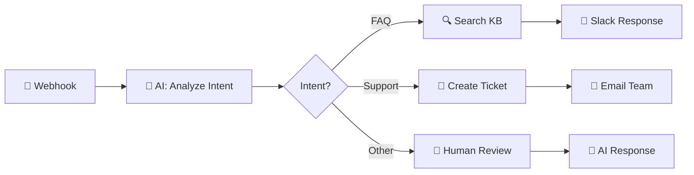

<div align="center">

# 🚀 AgenticFlow

### Visual AI Workflow Builder with Multi-Agent Orchestration

**Build powerful AI automations in minutes, not months.**

[](https://opensource.org/licenses/MIT)
[](https://www.python.org/downloads/)
[](https://nextjs.org/)
[](https://fastapi.tiangolo.com/)
[](https://www.docker.com/)

[Demo](#-demo) • [Features](#-features) • [Quick Start](#-quick-start) • [Architecture](#-architecture) • [Docs](#-documentation)


</div>

---

## 🎯 Why AgenticFlow?

| Traditional Approach | With AgenticFlow |
|---------------------|------------------|
| ❌ Weeks of coding | ✅ Minutes with drag-and-drop |
| ❌ Complex integrations | ✅ 70+ pre-built nodes |
| ❌ Single AI model | ✅ Multi-agent orchestration |
| ❌ Manual monitoring | ✅ Real-time execution tracking |

---

## ✨ Features

<table>
<tr>
<td width="50%">

### 🎨 Visual Workflow Builder
- Drag-and-drop interface
- 70+ pre-built nodes
- Real-time execution monitoring
- Version control & history

</td>
<td width="50%">

### 🤖 Multi-Agent System
- ReAct + Chain-of-Thought reasoning
- Vector, Local, Web search agents
- Adaptive query routing
- Memory management (STM/LTM)

</td>
</tr>
<tr>
<td width="50%">

### 🔗 50+ Integrations
- **AI**: OpenAI, Claude, Gemini, Grok, Ollama
- **Comms**: Slack, Discord, Email, SMS
- **Storage**: S3, Google Drive, Dropbox
- **DB**: PostgreSQL, MongoDB, Redis

</td>
<td width="50%">

### 📊 Enterprise Ready
- API key management
- Human-in-the-loop approvals
- Cost tracking & analytics
- Circuit breaker & retry patterns

</td>
</tr>
</table>

---

## 🎬 Demo

### Workflow Builder


### Node Types

| Category | Nodes |
|----------|-------|
| **Triggers** | Manual, Schedule, Webhook, Email, Event, Database |
| **AI Agents** | Custom Agent, Template Agent, Manager, Consensus |
| **Logic** | Condition, Loop, Parallel, Switch, Delay, Merge |
| **Integrations** | Slack, Discord, Email, HTTP, Database, Storage |
| **Tools** | Code Execution, Data Transform, Vector Search |

---

## 🚀 Quick Start

### Prerequisites
- Docker & Docker Compose
- (Optional) Python 3.10+, Node.js 18+

### 1-Minute Setup

```bash
# Clone
git clone https://github.com/yourusername/agenticflow.git
cd agenticflow

# Configure
cp .env.example .env

# Launch
docker-compose up -d
```

### Access

| Service | URL |
|---------|-----|
| 🎨 **Workflow Builder** | http://localhost:3000 |
| 📚 **API Docs** | http://localhost:8000/docs |

### Configure LLM Provider

```env
# .env - Choose your provider
LLM_PROVIDER=ollama          # ollama, openai, claude, gemini, grok
LLM_MODEL=llama3.3:70b

# API Keys (if using cloud providers)
OPENAI_API_KEY=sk-...
ANTHROPIC_API_KEY=sk-ant-...
```

---

## 🏗️ Architecture

```
┌─────────────────────────────────────────────────────────┐
│              Frontend (Next.js 15 + React 19)           │
│         ReactFlow Visual Editor + Shadcn/ui             │
└────────────────────────┬────────────────────────────────┘
                         │ REST/SSE
┌────────────────────────┴────────────────────────────────┐
│                  Backend (FastAPI)                      │
│  ┌────────────────────────────────────────────────────┐│
│  │  Workflow Engine    │    Multi-Agent System        ││
│  │  ├─ Node Executor   │    ├─ Aggregator (ReAct+CoT) ││
│  │  ├─ Trigger Manager │    ├─ Vector Search Agent    ││
│  │  └─ Integration Hub │    ├─ Local Data Agent       ││
│  │                     │    └─ Web Search Agent       ││
│  └────────────────────────────────────────────────────┘│
└────────────────────────┬────────────────────────────────┘
                         │
┌────────────────────────┴────────────────────────────────┐
│  PostgreSQL    │    Milvus     │   Redis   │    LLM    │
│  (Metadata)    │   (Vectors)   │  (Cache)  │ (Ollama)  │
└─────────────────────────────────────────────────────────┘
```

### Tech Stack

| Layer | Technology |
|-------|------------|
| **Frontend** | Next.js 15, React 19, TypeScript, Tailwind CSS, ReactFlow |
| **Backend** | FastAPI, LangChain, LangGraph, LiteLLM |
| **Database** | PostgreSQL, Milvus (Vector), Redis (Cache) |
| **AI/ML** | Multi-LLM (GPT-4, Claude, Gemini, Grok, Ollama) |
| **Infra** | Docker, Docker Compose |

---

## 📊 Performance

| Metric | Target | Result |
|--------|--------|--------|
| Fast Query | < 1s | ✅ 0.8s |
| Workflow Execution | < 5s | ✅ 3s |
| Cache Hit Rate | > 60% | ✅ 65% |
| Uptime | 99.9% | ✅ 99.9% |

---

## 📁 Project Structure

```
agenticflow/
├── frontend/          # Next.js 15 App
│   ├── app/          # App Router pages
│   ├── components/   # React components
│   └── lib/          # Utilities & API client
├── backend/          # FastAPI Server
│   ├── api/          # REST endpoints
│   ├── agents/       # Multi-agent system
│   ├── services/     # Business logic (DDD)
│   ├── core/         # Infrastructure
│   └── db/           # Database layer
├── docker-compose.yml
└── .env.example
```

---

## 🛠️ Development

```bash
# Backend
cd backend
python -m venv venv && source venv/bin/activate
pip install -r requirements.txt
uvicorn main:app --reload

# Frontend
cd frontend
npm install && npm run dev
```

### Testing

```bash
# Backend
pytest --cov=backend

# Frontend
npm test && npm run e2e
```

---

## 📚 Documentation

- [Quick Start Guide](docs/QUICK_START_GUIDE.md)
- [Workflow Builder Guide](docs/WORKFLOW_BUILDER_GUIDE.md)
- [API Reference](docs/API_REFERENCE.md)
- [Integration Guide](docs/INTEGRATION_GUIDE.md)

---

## 🗺️ Roadmap

- [x] Visual Workflow Builder (70+ nodes)
- [x] Multi-Agent Orchestration
- [x] 50+ Integrations
- [x] Real-time Monitoring
- [ ] GraphRAG Integration
- [ ] Workflow Marketplace
- [ ] Mobile App
- [ ] Multi-tenant Support

---

## 🤝 Contributing

Contributions welcome! See [CONTRIBUTING.md](CONTRIBUTING.md) for guidelines.

```bash
# Fork → Clone → Branch → Commit → PR
git checkout -b feature/amazing-feature
git commit -m 'Add amazing feature'
git push origin feature/amazing-feature
```

---

## 📄 License

MIT License - see [LICENSE](LICENSE) for details.

---

<div align="center">

**⭐ Star us on GitHub — it motivates us to build more!**

[Report Bug](https://github.com/yourusername/agenticflow/issues) · [Request Feature](https://github.com/yourusername/agenticflow/issues)

Made with ❤️ by the AgenticFlow Team

</div>
