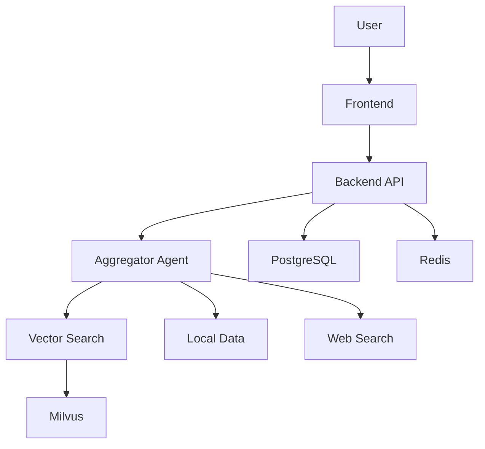

# 📸 Screenshots Guide

This guide explains how to capture and add screenshots for the README.

## Required Screenshots

### 1. Demo GIF (Priority: High)

**Location**: `docs/images/demo.gif`

**Content**: 
- Show complete user flow
- Upload document → Ask question → Get answer with sources
- Duration: 15-30 seconds
- Resolution: 1920x1080 or 1280x720

**Tools**:
- [ScreenToGif](https://www.screentogif.com/) (Windows)
- [Kap](https://getkap.co/) (macOS)
- [Peek](https://github.com/phw/peek) (Linux)

**Steps**:
1. Start recording
2. Upload a sample document
3. Type a question in chat
4. Show real-time streaming response
5. Highlight source citations
6. Stop recording
7. Optimize GIF (< 10MB)

### 2. Chat Interface

**Location**: `docs/images/chat.png`

**Content**:
- Clean chat interface
- Multiple messages
- Source citations visible
- Agent reasoning steps shown

**Capture**:
```bash
# Navigate to chat page
http://localhost:3000

# Upload document and ask questions
# Take screenshot (Cmd+Shift+4 on Mac, Win+Shift+S on Windows)
```

### 3. Document Upload

**Location**: `docs/images/upload.png`

**Content**:
- Document upload interface
- File list with metadata
- Processing status
- Success message

**Capture**:
```bash
# Navigate to upload page
http://localhost:3000/dashboard

# Show document list
# Take screenshot
```

### 4. Monitoring Dashboard

**Location**: `docs/images/monitoring.png`

**Content**:
- Performance metrics
- Query distribution chart
- Response time graph
- Cache hit rate

**Capture**:
```bash
# Navigate to monitoring
http://localhost:3000/monitoring

# Wait for data to populate
# Take screenshot
```

### 5. Agent Reasoning

**Location**: `docs/images/reasoning.png`

**Content**:
- Agent decision tree
- Step-by-step reasoning
- Tool usage
- Final answer

**Capture**:
```bash
# Ask a complex question
# Expand reasoning panel
# Take screenshot showing full reasoning process
```

## Screenshot Guidelines

### Resolution
- Minimum: 1280x720
- Recommended: 1920x1080
- Maximum: 2560x1440

### Format
- PNG for UI screenshots (better quality)
- GIF for animations (< 10MB)
- JPG for photos (if needed)

### Optimization

```bash
# Install optimization tools
npm install -g imageoptim-cli

# Optimize PNG
imageoptim docs/images/*.png

# Or use online tools
# - TinyPNG: https://tinypng.com/
# - Squoosh: https://squoosh.app/
```

### Naming Convention

```
docs/images/
├── demo.gif                    # Main demo
├── chat.png                    # Chat interface
├── upload.png                  # Document upload
├── monitoring.png              # Monitoring dashboard
├── reasoning.png               # Agent reasoning
├── architecture.png            # System architecture
├── performance-chart.png       # Performance metrics
└── mobile-*.png               # Mobile screenshots
```

## Creating Architecture Diagrams

### Tools
- [Excalidraw](https://excalidraw.com/) - Hand-drawn style
- [Draw.io](https://app.diagrams.net/) - Professional diagrams
- [Mermaid](https://mermaid.live/) - Code-based diagrams

### Example: System Architecture



Save as PNG and add to `docs/images/architecture.png`

## Adding Screenshots to README

### Inline Image

```markdown

```

### With Link

```markdown
[](docs/images/chat.png)
```

### Centered with Caption

```markdown
<div align="center">
  
  <p><em>Chat interface with real-time streaming and source citations</em></p>
</div>
```

### Collapsible Section

```markdown
<details>
<summary>📸 Click to view screenshots</summary>

### Chat Interface


### Document Upload


</details>
```

## Sample Data for Screenshots

### Documents to Upload
1. Sample PDF with tables
2. Korean HWP document
3. PowerPoint presentation
4. Excel spreadsheet

### Questions to Ask
1. "이 문서의 핵심 내용은 무엇인가요?" (Korean)
2. "Summarize the main findings in the table"
3. "Compare the data from Q1 and Q2"
4. "What are the key recommendations?"

## Checklist

Before submitting screenshots:

- [ ] All images are optimized (< 500KB each)
- [ ] GIF is under 10MB
- [ ] No sensitive information visible
- [ ] UI is clean (no debug info)
- [ ] Text is readable
- [ ] Colors are accurate
- [ ] Consistent theme (light/dark)
- [ ] All required screenshots captured
- [ ] Images added to README
- [ ] Alt text provided

## Tips

### Clean UI
- Clear browser cache
- Use incognito mode
- Hide browser extensions
- Use default zoom (100%)

### Consistent Styling
- Use same theme for all screenshots
- Same browser for consistency
- Same window size
- Same sample data

### Professional Look
- Clean desktop background
- Hide personal information
- Use sample/demo data
- Crop unnecessary parts

### Accessibility
- Add alt text to all images
- Describe what's shown
- Use descriptive filenames

## Example Alt Text

```markdown
<!-- Good -->


<!-- Bad -->

```

## Updating Screenshots

When updating screenshots:

1. Keep old versions in `docs/images/archive/`
2. Update all references in documentation
3. Maintain same naming convention
4. Update changelog

## Questions?

If you need help with screenshots:
- Open an issue with label `documentation`
- Ask in GitHub Discussions
- Check existing screenshots for reference

---

**[← Back to README](../README.md)**
